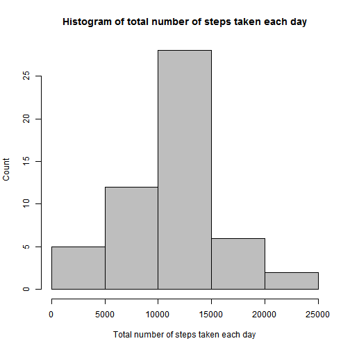
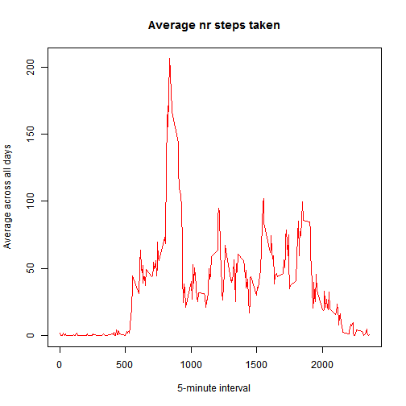
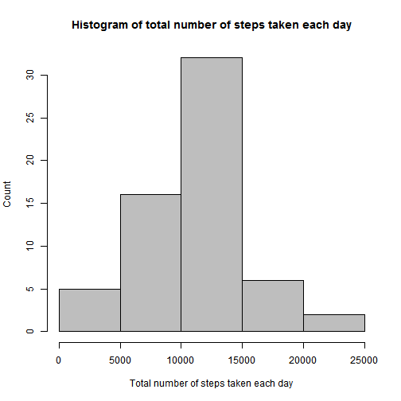
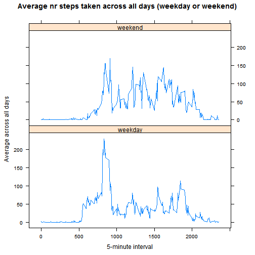

###Loading and preprocessing the data
*1. Load the data (i.e.read.csv()).*

First, we download the file needed for this analysis.
This codechunk will also check if the file is already present.


```r
filename <- "Assignment_file.zip"
if (file.exists(filename)){
        unzip(zipfile = filename)
} else {
        path <- getwd()
        url_to_file <- "https://d396qusza40orc.cloudfront.net/repdata%2Fdata%2Factivity.zip"
        download.file(url_to_file, file.path(path, filename))
        unzip(zipfile = filename)
}
```

*2. Process/transform the data (if necessary) into a format suitable for your analysis.*

Then we import and clean the dataset.


```r
#Check if dataset exists. If not, create dataset
        filename_unzipped <- "activity.csv"
        if (exists("dataset")) {
        } else {
                dataset <- read.csv(filename_unzipped, header = TRUE, sep = ",",
                na.strings = "NA"
                )
        }
```

```
## NULL
```

```r
#Remove NA's and convert date in dataset to real date
#Here the new dataset is renamed, to keep the original dataset for later use
        dataset_na_omitted <- na.omit(dataset)
        dataset_na_omitted$date <- as.Date(dataset_na_omitted$date)
```

###What is mean total number of steps taken per day?
*1. Calculate the total number of steps taken per day*
*2. Make a histogram of the total number of steps taken each day.*


```r
#Create a dataset that summarize the steps for each date, use the dataset with NA's omitted
        dataset_totalstep_day <- aggregate(steps ~ date, dataset_na_omitted, FUN = sum)

#Create a histogram with the dataset just created
        hist(
                dataset_totalstep_day$steps,
                xlab = "Total number of steps taken each day",
                ylab = "Count",
                main="Histogram of total number of steps taken each day",
                col = 8
        )
```



*3. Calculate the mean and the median of total steps per day.*


```r
#The mean and median reported, are based on the dataset created i the previous step
        steps_mean <- mean(dataset_totalstep_day$steps)
        steps_median <- median(dataset_totalstep_day$steps)
```

**The mean of the total steps per day is 10766.19 and the median of
the total steps per day is 10765.**

###What is the average daily activity pattern?
*1. Make a time series plot (i.e.type = "l") of the 5-minute interval (x-axis) and the average number of steps taken, averaged across all days (y-axis)*


```r
#Create a dataset that takes the mean of the steps in each interval, use the dataset with NA's omitted
        dataset_time_series <- tapply(dataset_na_omitted$steps, dataset_na_omitted$interval, mean, na.rm= TRUE)

#Create time series plot with the dataset just created
        plot(
                row.names(dataset_time_series), dataset_time_series, type = "l",
                xlab = "5-minute interval",
                ylab = "Average across all days",
                main="Average nr steps taken",
                col = 2
        )
```



*2. Which 5-minute interval, on average across all the days in the dataset, contains the maximum number of steps?*


```r
#Find the datapoint with the highest value, extract both value, name and position
        max_int <- which.max(dataset_time_series)
        max_int_names <- names(max_int)
        max_int_value <- dataset_time_series[max_int[[1]]]
```

**The datapoint that contains the maximum number of steps is datapoint named 835 in the dataset named "dataset_time_series". This datapoint is at position 104, and contains the value 206.17.**

###Imputing missing values
*1. Calculate and report the total number of missing values in the dataset (i.e. the total number of rows with NAs)*


```r
#Count number of missing values in original dataset
        amount_missing_values <- sum(is.na(dataset))
```

**The amount of missing values in the dataset is 2304.**

*2. Devise a strategy for filling in all of the missing values in the dataset. The strategy does not need to be sophisticated. For example, you could use the mean/median for that day, or the mean for that 5-minute interval, etc.*

I have chosen to use a package called DMwR for this task. This method use kNN Imputation (K nearest neighbours) approach to impute missing values.

*3. Create a new dataset that is equal to the original dataset but with the missing data filled in.*


```r
#Use kNN Imputation to create a new dataset with missing data imputed with
#kNN imputation from the DMwR package.
#Use the original dataset
        require(DMwR)
        dataset_with_imputation <- knnImputation(dataset[, !names(dataset) %in% "dataset$steps"])
```

*4. Make a histogram of the total number of steps taken each day and Calculate and report the mean and median total number of steps taken per day. Do these values differ from the estimates from the first part of the assignment? What is the impact of imputing missing data on the estimates of the total daily number of steps?*


```r
#Create a dataset that summarize the steps for each date, use the dataset with missing data imputed
        dataset_totalstep_day_imputed <- aggregate(steps ~ date, dataset_with_imputation, FUN = sum)
#convert date in dataset to real date
        dataset_totalstep_day_imputed$date <- as.Date(dataset_totalstep_day_imputed$date)

#Create a histogram with the dataset just created
        hist(
                dataset_totalstep_day_imputed$steps,
                xlab = "Total number of steps taken each day",
                ylab = "Count",
                main="Histogram of total number of steps taken each day",
                col = 8
        )
```




```r
#Use the dataset created in the previous step (the same dataset that was used in the histogram)
        steps_mean_imputed <- mean(dataset_totalstep_day_imputed$steps)
        steps_median_imputed <- median(dataset_totalstep_day_imputed$steps)
```

**The mean of the total steps per day is 10637.85 and the median of
the total steps per day is 10600.**

**By imputing missing data on the estimates of the total daily number of steps, we change both the histogram, the mean and the median. We now see that there are more days with a lower number of steps (especially between 5k to 10k, and 10k to 15k), this is reflected in a lower mean and median.**

###Are there differences in activity patterns between weekdays and weekends?

*1. Create a new factor variable in the dataset with two levels - "weekday" and "weekend" indicating whether a given date is a weekday or weekend day.*


```r
#Use the dataset with missing values imputed, but not aggregated
#convert date from factor to date in the dataset        
        dataset_with_imputation$date <- as.Date(dataset_with_imputation$date)
#create new factor, that define if the date is weekday or weekend
#Since I have norwegian locale on my machine, 'lørdag' is saturday and 'søndag' is sunday.
        dataset_with_imputation$week <- ifelse(weekdays(dataset_with_imputation$date) %in%
        c("lørdag", "søndag"), "weekend", "weekday")
```

*2. Make a panel plot containing a time series plot (i.e.type = "l") of the 5-minute interval (x-axis) and the average number of steps taken, averaged across all weekday days or weekend days (y-axis).*


```r
#Use the newly created dataset, that has a factor defining weekday or weekend.
        xyplot(steps ~ interval | week,
                aggregate(steps ~ interval + week, data = dataset_with_imputation, mean),
                type = "l", layout = c(1, 2),
                xlab = "5-minute interval",
                ylab = "Average across all days",
                main="Average nr steps taken across all days (weekday or weekend)")
```



**The activty in the weekend, are more even distributed than in the weekdays, on average.**
**So, yes, there are differences in activity patterns between weekdays and weekends**
